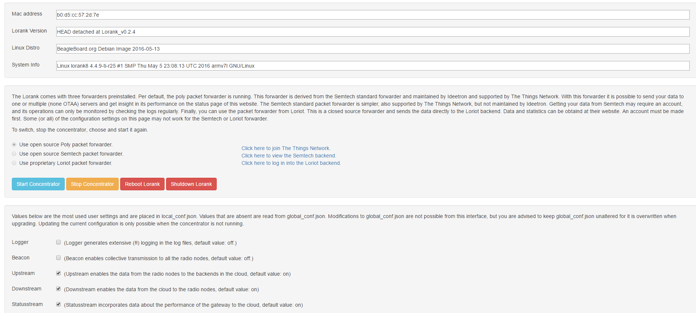
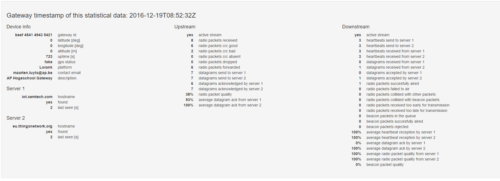

#LoRa Gateway
##Korte inleiding
Als extra toevoeging aan ons project werd ons voorgesteld om LoRa WAN eens te bekijken.
We zouden dit kunnen gebruiken als extra hardware aan ons project van Internet of Things.
Naast het Park assistentie systeem dat wij hebben ontworpen, gaan we een anti-inbraaksysteem maken.

##Hardware
- LoRa Gateway
- LoRa Mote
- IR Distance Sensor
- Arduino Uno/Nano

## Hoe beginnen we eraan?
Voor de gateway aan de praat te krijgen, hebben we een voedingsbron nodig. Deze kan men via een USB-kabel verbinden met een laptop en hiermee via poweren.
Voorts hebben we ook een Ethernet kabel nodig om de LoRa Gateway van internet te voorzien.
De Ethernet kabel hebben we dan ook aan de laptop gehongen en dan via DHCP gaven we de LoRa Gateway internet.
Voor te beginnen maakten we ook gebruik van de Manual en installation guide van ideetron.
Deze zijn ook te vinden in de documentatie onder de map ExtraToevoeging.

##Praten met de LoRa Gateway
We kunnen via de seriële connectie met Putty op de gateway geraken.
Aangezien het de eerste keer was dat de gateway werd gebruikt, zijn de default inloggegevens nog geldig.
Deze kan men ook vinden in de Installation Guide van de LoRa Gateway. Deze default gegevens zijn nog momenteel nog in gebruik. (Login: root; pwd: LorankAdmin)
De Gateway forward als default het Poly pakket. Deze pakketjes worden gebruikt in The Things Network. Tevens ook het netwerk dat wij als verzendmogelijkheid zien voor onze toepassing.
Omdat het ook de eerste keer is dat men de gateway gebruikt, was het ook nodig om de certificaten te installeren.
> Dit ging via het commando: apt-get install ca-certificates.

Eens dit gebeurt was, konden we verder gaan met het proces.

##Verbinding met het internet
Eens de installatie voorbij was, konden we verder aan de slag met de gateway.
Vanaf dit punt maakten we ook gebruik van de Manual van Ideetron.
Beide de USB-kabel en de Ethernet-kabel waren verbonden, en de lampjes van de gateway branden, dus konden we verder aan de slag.
Als eerste moesten we ontdekken op welk IP-adres we de gateway konden bereiken.
> Met het alomgekende ifconfig kwamen we hier makkelijk achter.

In het netwerkcentrum zetten we een netwerkbrug op; een brug tussen Ethernet & de Wifi-module van de laptop.
Zo konden we een IP-adres geven aan de LoRa Gateway en kon deze naar de buitenwereld toe zichtbaar worden.

#####Voorts gingen we naar onze favoriete browser, Google Chrome en typten we dat IP-adres in.
Als we surften naar dat adres kwamen we terecht op het adminscherm van de gateway.
Hierop was te zien met welke server hij verbonden was, hoeveel pakketjes er al op werden verstuurd...
Er was een tabel te zien met Upstream-data en een tabel met Downstream-data.

Verder kon men ook instellen welke soort pakketjes men wou ontvangen en versturen via de gateway.
Men kon kiezen voor de Poly Packets van TTN, die van Semtech of Loraley

##Waarom TTN?
The Things Network is een netwerk dat Crowd Sourced IOT van vrij gebruik voorziet; Op dit netwerk is het voor ons dus ook toegestaan om ons project verder te realiseren.

Semtech is een bedrijf dat een router host dat alle gateways mogen gebruiken voor demonstratie doeleinden.
Semtech stelt dus enkel hun services vrij voor demonstraties, het zou maar een tijdelijke oplossing zijn.

Loraley is een alternatief open source data netwerk, deze is nog in primitieve staat dus nog niet aan te raden als betrouwbaar netwerk. Het is dus nog niet Up & Running naar behoren.

* * *
##Connectie met het TTN netwerk
Om connectie te kunnen maken met de servers van het TTN netwerk, moesten we wat aanpassen in de configuratie van de module.
We moesten in de local_conf.json file een aanpassing maken.
> cd lorank8-0.2.3

> cd packet_forwarder

> cd poly_pkt_fwd

> nano local_conf.json

In deze json file voegen we het volgende toe:

	"servers":[{
    		"server_address : "<eu.thingsnetwork.org>",
            "serv_port_up":1700,
            "serv_port_down":1700,
            "serv_enabled":true
    }]

####Et voilà!

De gateway heeft connectie met de servers, zendt en ontvangt ook heartbeats van de servers!
De connectie tussen gateway en servers wordt ook om de +-2 min. getest.
+
Men kan ook in real time de quality van de datastreams zien.

##Packets ontvangen & verzenden
Als men pakketjes verstuurd via de LoRa Mote, dan is dit ook zichtbaar op het dashboard van de gateway.
Bij de tabel Upstream krijgen we radio packets aan; ook wordt er een onderscheid gemaakt tussen pakketjes die goed of slecht worden ontvangen. Degene die goed werden ontvangen, zullen verder worden verzonden naar de server.
Deze pakketjes worden dan als datagrams verstuurd naar de server( men krijgt ook een acknowledgement van de TTN server als dit gebeurd).

In de downstream tabel kan men zien of de datagrams ontvangen werden door de server, alsook of de radio packets succesvol over het netwerk zijn gestuurd.

##Logging

Het dashboard van de LoRa Gateway is opzich al een handige tool om te kunnen bekijken wat er door de gateway komt. Maar natuurlijk zijn de logs daar ook een heel handig gegeven voor.
Om deze te kunnen bekijken gebruik je dit commando:
> tail -f /var/log/syslog

Bij een werkend systeem zie je dan ongeveer zo een logs.

Tussen deze logs kan je zien hoeveel packets ontvangen zijn, percentage geslaagde/gefailde zendingen, forwarded packets.
Alsook wat er downstream gebeurd, gps tracking (indien dit ingesteld is) en de performance van de connectie.

######Source: https://www.thethingsnetwork.org/wiki/Backend/Connect/Gateway

