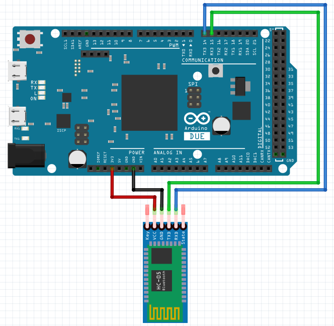
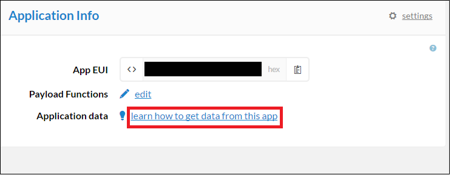
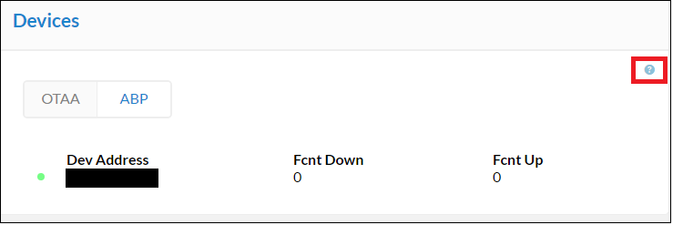
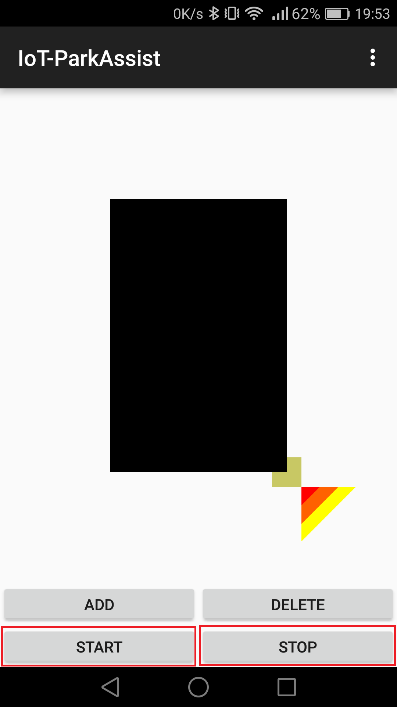
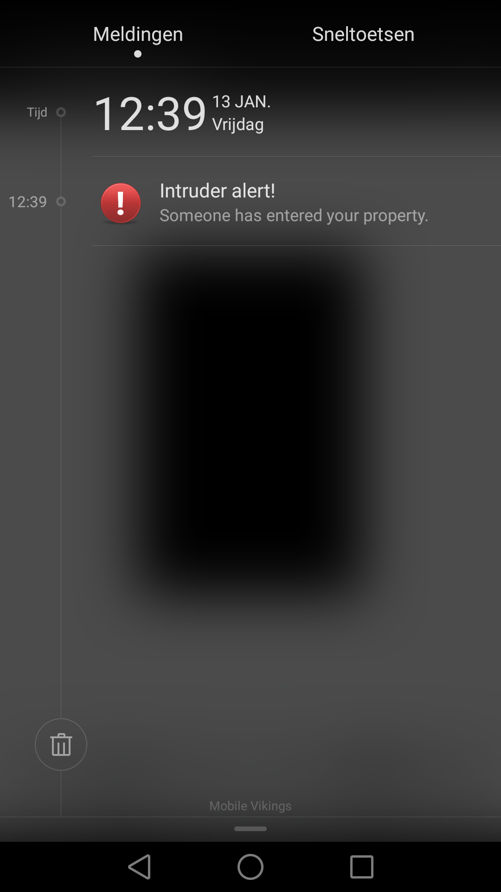
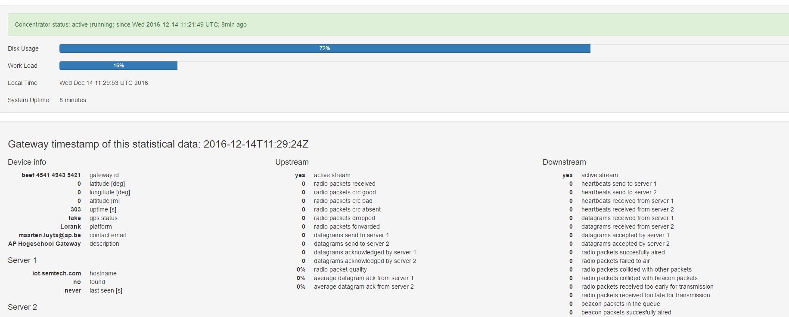
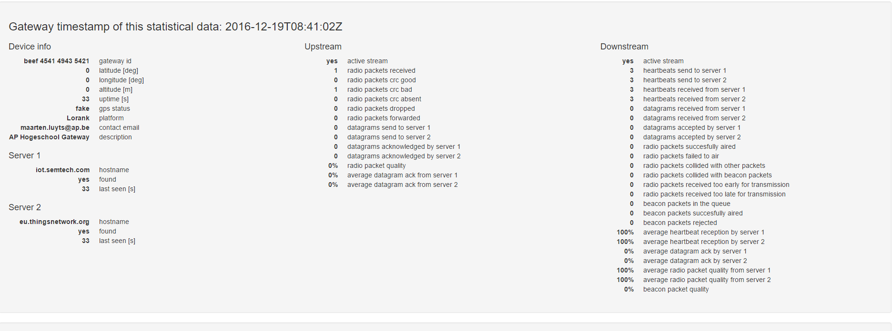
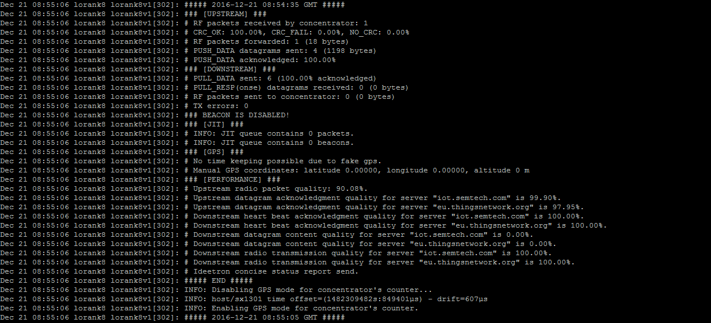

# Inbraakdetectiesysteem

In deze handleiding vindt u alle informatie terug die nodig is om zelf dit project te maken. Het project bestaat uit een module die in de caravan komt te staan en een gateway die ervoor zorgt dat de verzonden data naar de applicatie geraakt.

## Inhoudsopgave

<!-- START doctoc -->
<!-- END doctoc -->

## Hardware

- [LoRa Gateway](http://webshop.ideetron.nl/LORANK-8)

- [LoRa Mote](http://www.microchip.com/DevelopmentTools/ProductDetails.aspx?PartNO=dm164138)

- [IR Distance Sensor](http://qqtrading.com.my/infrared-proximity-sensor-4cm-30cm-sharp-gp0a41sk)

- [Arduino DUE](https://www.arduino.cc/en/Main/arduinoBoardDue)

- [Bluetooth module HC05](http://www.martyncurrey.com/hc-05-fc-114-and-hc-06-fc-114-first-look/)


Datasheets etc. zijn te vinden op de link van ieder device.


## Module Hardware

### LoRa Mote verbinden met Arduino

Verbind de Mote op de volgende manier met de Arduino DUE:


Indien je de LoRa Mote gebruikt, zorg er dan altijd voor dat de antenne verbonden is met het board voor je er stroom opzet. Indien je dit niet doet, kan dit ernstige schade toebrengen.


### Arduino verbinden met Bluetooth module

Verbind de Arduino DUE op de volgende manier met de Bluetooth module:





De RX van de bluetooth module kan maar 3,3V aan, waardoor er normaal een spanningsdeler wordt gebruikt tussen de TX van de arduino en de RX van de bluetooth module. Zoals te zien is op de foto is deze spanningsdeler niet aanwezig, aangezien de Arduino Due standaard op 3,3V werkt.


### IR sensor verbinden met Arduino

Verbind de IR sensor op de volgende manier met de Arduino DUE:


## Module software

### The Things Network

#### Waarom TTN?


The Things Network is een netwerk dat Crowd Sourced IOT van vrij gebruik voorziet. Met andere woorden staat dit netwerk ons to om ons project te realiseren en later misschien zelfs in productie te brengen.


Naast TTN zijn er nog andere opties, maar deze zijn minder geschik voor ons project:


- Semtech is een bedrijf dat een router host dat alle gateways mogen gebruiken voor demonstratie doeleinden. Semtech stelt dus enkel hun services vrij voor demonstraties, wat betekent dat het maar een tijdelijke oplossing zou zijn indien we het project ook in productie willen brengen.


- Loraley is een alternatief open source data netwerk dat nog in primitieve staat is en dus nog niet aan te raden is als betrouwbaar netwerk. Het is dus nog niet Up & Running naar behoren.


#### Applicatie registreren


Voor we data met de LoRa Mote kunnen verzenden, moeten we op TTN een applicatie toevoegen. Deze applicatie zal de nodige info bevatten om ervoor te zorgen dat we met onze android applicatie de verzonden data kunnen ophalen.


Ga naar de volgende site van TTN (https://v1.account.thethingsnetwork.org/users/login) en maak hier een account aan. Eenmaal je ingelogd bent, ga je naar je dashboard. Op je dashboard klik je op "create application", waarna je je applicatie een naam geeft. Nu je je applicatie toegevoegd hebt, kan je alle informatie terugvinden die je nodig hebt om data verzonden naar deze applicatie te verkrijgen. Deze informatie krijg je door op "learn how to get data from this app" in het deel "application info" te klikken.





#### Device registreren

Nu je een application hebt geregistreerd, kan je devices aan deze applicatie toewijzen. Deze devices zijn de nodes waarmee we data naar het netwerk verzenden. In ons geval willen we de LoRa Mote registreren.


Een nieuw device registreren doen we door bij devices op het vraagteken te klikken, waarna we "register device" selecteren.





Wanneer we een device willen registreren kunnen we kiezen uit twee manieren van activatie, namelijk ABP en OTAA.


###### Activation By Personalization (ABP)

In sommige gevallen is het een noodzaak om security keys en Device Address te hardcoden op het device. Met deze strategie hou je het systeem simpeler, omdat het gehele join process dan niet meer nodig is. Het geeft dan wel mogelijk een security-risico.


###### Over The Air Activation (OTAA)

Vaakst voorkomende en meest veilige manier om met The Things Network te verbinden. Devices zullen hierbij eerst een join-procedure met het netwerk uitvoeren. Tijdens deze procedure zullen de devices een dynamisch Device Address krijgen en zullen de security keys worden onderhandeld.


Omdat het voor ons als nieuwe gebruikers eenvoudiger was om via ABP te verbinden, hebben wij voor deze optie gekozen. Indien je toch gebruik wilt maken van OTAA kan dit en dit is ook ondersteunt in de door ons gebruikte code (dit staat uiteraard wel in comments).


Indien je ABP hebt gekozen, kan je gewoon op "Register" klikken, aangezien de "App session key" en de "Network session key" random gegenereerd worden. Nu is je device geregistreerd en klaar om gebruikt te worden.


Indien je naar de pagina van je device gaat, zal je zien dat je hier alle informatie vindt die je nodig hebt om met je device connectie te maken met TTN. Op deze pagina kan je ook alle  data zien die je met je device naar TTN hebt verzonden.


### Arduino code

De code die we op de Arduino zetten is [hier](https://github.com/AP-Elektronica-ICT/iot16-park-assist/blob/Lora/src/Arduino/LoRa_volledig_werkend/LoRa_volledig_werkend.ino) te verkrijgen. Deze code zal automatisch blijven proberen te verbinden met TTN en indien dit gelukt is, zal het wachten op data die hij binnenkrijgt via de bluetooth module. Deze data zal via de android applicatie verzonden worden.


Indien de code een "Y" binnenkrijgt, zal het de IR sensor een afstand laten uitlezen, wat onze referentie afstand zal zijn. Vanaf dit moment zal er gedetecteerd worden wanneer de afstand veranderd, waarna er  een bericht via de LoRa Mote verzonden zal worden naar TTN.


Indien de code een "N" binnenkrijgt, zal het het uitlezen van de afstand stoppen en zullen er geen berichten meer via de LoRa Mote verzonden worden.


In de code zal je in het volgende stukje je device gegevens moeten ingeven aan de hand van welke activatie manier je hebt gekozen.


```

//ABP: initABP(String addr, String AppSKey, String NwkSKey);

join_result = myLora.initABP("9CC4931F", "F6A0912BC9B5CC12075D87D9A0553C89", "82E46DC9ABE0730FA1694B91677E37C0");

  

//OTAA: initOTAA(String AppEUI, String AppKey);

//join_result = myLora.initOTAA("70B3D57ED00001A6", "A23C96EE13804963F8C2BD6285448198");

```


### Application code

De code voor de applicatie die we in dit project gebruiken is [hier](http://) te vinden. Aangezien in deze applicatie ook de code zit voor de parkeersensors, is het van belang dat je enkel de bluetooth module van dit project aan je smartphone gekoppeld hebt en niets anders.

Deze applicatie zal verbinden met de MQTT server van TTN en zich registreren op het topic van ons gebruikte device. Indien je dit voor je eigen device wilt doen, moet je de volgende lijnen in de code aanpassen met de gegevens van je eigen geregistreerde applicatie en device op TTN. Deze code is terug te vinden in [mqttClass.java](http://).


```

client = new MqttAndroidClient(classContext, "tcp://staging.thethingsnetwork.org:1883", clientId);


options.setUserName("70B3D57ED00018A3");

options.setPassword("nrmLIdzcRc+zQTpiWO7QGvwCCJtN7Kw0F5how6WjBbY=".toCharArray());


String topic = "70B3D57ED00018A3/devices/000000009CC4931F/up";

```
#### Applicatie installeren
Voor we de applicatie kunnen gebruiken, zullen we deze eerst op de smartphone moeten zetten. Om dit te doen, verbinden we de smartphone met de laptop en openen we de applicatie in "Android Studio". In Android studio klik je op run in het menu, waarna je je smartphone selecteert en op "OK" klikt.


Na een tijdje zal er op je scherm gevraagd worden of je de applicatie wilt installeren, selecteer hier "installeren". Nu wordt de applicatie geïnstalleerd, waarna deze klaar is om te gebruiken.

#### Werking applicatie

Nu alles klaar is voor gebruik, hoef je enkel nog maar je bluetooth te koppelen met de bluetooth module van de Arduino. Het is van belang dat dit het enigste gekoppelde device op je smartphone is.

Om het alarm aan te zetten, moet je nu enkel op start klikken om "Y" naar de Arduino te sturen, wat het alarm zal aanzetten. Indien je op stop klikt, zal er "N" naar de Arduino gezonden worden, wat het alarm zal afzetten.



Indien de module data naar de MQTT server stuurt, zal de applicatie dit zien en een notificatie aan de gebruiker geven als waarschuwing dat er iemand het alarm heeft doen afgaan.



## LoRa Gateway

### Hoe beginnen we eraan?

Voor we iets kunnen doen met de gateway, is er natuurlijk een voedingsbron nodig, men kan deze via een USB-kabel verbinden met een laptop en deze hiervan poweren. Voorts hebben we ook een Ethernet-kabel nodig om de LoRa Gateway van internet te kunnen voorzien.

Omdat het de eerste keer was dat we met dit materiaal werken, hebben wij gebruik gemaakt van de Manual en Installation Guide van Ideetron, de leverancier van het materiaal.


### Praten met de LoRa Gateway

Om de LoRa Gateway te kunnen gebruiken, hebben we de gateway verbonden via een seriële poort. Zodus konden we gebruik maken van Putty om via seriële connectie te kunnen praten met de gateway.
Aangezien het ook de eerste keer was, dat de gateway werd gebruikt, waren de default inlog gegevens nog in gebruik. Deze inloggegevens zijn ook vindbaar in de Installation Guide van de LoRa Gateway.
De guide hebben we gevonden via de verkoper van het toestel.
Als men toevallig nog toegang nodig zou hebben, deze gegevens zijn nog steeds in gebruik (Login: root; pwd: LorankAdmin).

De LoRa Gateway gebuikt als default forwarder, het Poly pakket. Dit pakket wordt gebruikt in The Things Network. Tevens is dit het netwerk dat wij gebruiken om onze toepassing op te laten werken.
Deze keuze is bewust gemaakt met reden dat dit de makkelijkste methode is en er de meeste uitleg over te vinden is.

Om de Gateway te laten werken, moest men ook de nodige certificaten installeren om connectie te kunnen hebben. 
> Dit kan eenvoudig gedaan worden via het commando: apt-get install ca-certificates

Eens dit was geïnstalleerd, kan verder worden gegaan met het proces.

### Verbinding met het internet

*Vanaf dit punt maken we gebruik van de Manual guide van Ideetron.*

Om verder aan de slag te kunnen gaan met de Gateway, was er natuurlijk connectie met het internet nodig. We hadden natuurlijk een (RJ-45) Ethernet-kabel nodig om tot het internet te kunnen geraken.

Als eerste moesten we ontdekken op welk IP-adres we het gateway dashboard konden bereiken.
> Met het alomgekende ifconfig, was dit een simpele taak.

De Ethernet-kabel zit momenteel nog enkel in de poort van de laptop ingestoken. Hierdoor heeft de gateway dus nog steeds geen connectie.
Dit kan opgelost worden door een netwerkbrug op te zetten tussen de Wifi-module van de laptop en de Ethernet-kabel waarmee de Gateway was verbonden.
Zo kan er een IP-adres gegeven worden aan de LoRa Gateway en kan men deze ook vanuit de "buitenwereld" bereiken.
> snel nog even een ifconfig in de commandline en we weten het IP van de gateway.

Voorts kan men naar een van uw favoriete browsers gaan en het IP adres intypen (Wij kozen voor Google Chrome).  
Als men dan surft naar dat adres, dan komt men terecht op het dashboard van de gateway. Op dit dashboard kan men vinden met welke server de gateway is verbonden, alsook informatie over de pakketjes.
Handig aan dit scherm is dat men zowel Upstream als Downstream kan meevolgen wat er wordt verstuurd, of de pakketjes zijn aangekomen of hoeveel er niet zijn doorgeraakt.





In de Admintab kan men ook instellen welke soort pakketjes men wou ontvangen en versturen via de Gateway. Men kan hier kiezen uit de Poly Packets van TTN, de packets van Semtech of die van Loraley.


### Connectie met het TTN netwerk

Natuurlijk is er ook connectie nodig met The Things Network zelf, zonder dit staat de Gateway niets te doen en kan men ook geen berichten verzenden over het netwerk. Om dit te doen, zijn er enkele aanpassingen nodig.
De configuratie van de module heeft een aanpassing nodig en om nauwkeuriger te zijn de local_conf.json file.
 >cd lorank8-0.2.3

> cd packet_forwarder

>cd poly_pkt_fwd

> nano local_conf.json

In deze json file moet dit worden toegevoegd:


	"servers":[{

    		"server_address : "<eu.thingsnetwork.org>",

            "serv_port_up":1700,

            "serv_port_down":1700,

            "serv_enabled":true

    }]





Nu heeft de gateway connectie met de servers, hij zendt en ontvangt ook heartbeats van de servers. De verbinding tussen gateway en server wordt +- om de 2 minuten getest, volgens onze observatie.
Men kan nu dus ook in realtime de quality van de datastreams zien.


### Packets ontvangen & verzenden

Na verzenden van pakketjes via de LoRa Mote, dan is dit ook visueel zichtbaar op het dashboard van de gateway. In de tabel Upstream kan men zien hoeveel packets er worden ontvangen en of deze al dan niet goed werden ontvangen door de gateway.
De packets die men goed kan ontvangen, zullen worden geforward naar de TTN server. Dit keer zullen ze wel als datagrams worden verstuurd ipv losse packetjes.
Als dit gebeurd is, dan krijgt men ook een acknowledgement van de TTN server teruggestuurd.


In de Downstream tabel kan men zien of de datagrams aangekomen zijn om de server, alsook of de radio packets succesvol over het netwerk zijn verstuurd.


### Logging


Het dashboard van de LoRa Gateway is opzich al een handige tool om te kunnen bekijken wat er door de gateway allemaal heen gaat, maar daar zijn logs natuurlijk nog een handiger gegeven voor.
Als men even teruggaat naar Putty dan kan men via een handig commando ook meekijken wat er gebeurt.


> tail -f /var/log/syslog


Bij een werkend systeem zien de logs er +- als volgend uit.




Tussen deze logs, vind men informatie over hoeveel packets ontvangen zijn, percentages over geslaagde of mislukte zendingen, packets die geforwarded zijn.
Ook wat er downstream allemaal gebeurd, gps tracking en de performacie van de verbinding.


## Testing

Indien je de LoRa Mote wilt uittesten zonder gebruik te maken van de Arduino en de applicatie, kan je dit op volgende manier doen. We gaan bij deze stappen er wel van uit dat de Gateway aanstaat en verbonden is met TTN.


### Verbinden met RN2483

Indien je rechtstreeks verbinding wilt maken met de RN2483 Transceiver module die zich op het board bevind, zal je je laptop via een USB to Micro-USB kabel moeten verbinden met de LoRa Mote.


Nadat dit is gebeurt, zal de LoRa Mote opstarten, waarna we Serieel verbinding kunnen maken. Dit doen we door een programma met de naam "termite 3.2" te gebruiken, aangezien "Putty" hier niet zal werken. Op termite zal je de volgende instellingen moeten aanpassen:


- Baud rate: 57600

- Parity: none

- local echo: on

- data bits: 8

- stop bits: 1

- flow control: none

- append CR+LF: on


Eenmaal dit alles gedaan is, kunnen we verbinding maken met de RN2483 Transceiver module. De verschillende commando's die hier gebruikt kunnen worden, zijn [hier](http://ww1.microchip.com/downloads/en/DeviceDoc/40001784B.pdf) terug te vinden.


Door gebruik te maken van deze commando's is het mogelijk om data te verzenden etc...


### RN2483 configureren

Voor we TTN kunnen joinen zullen we eerst de nodige gegevens moeten instellen. In het geval van ABP activatie, zoals we in dit project gebruiken, moeten we het "device address", "network session key" en "application session key" instellen, wat we met de volgende commando's doen:

> mac set devaddr [address]

> mac set nwkskey [network session key]

> mac set appskey [application session key]


Bij deze commando's is het element tussen de vierkante haken hetgeen dat vervangen moet worden door de relevante data.


### TTN joinen

Nu alles ingesteld is, kunnen we verbinding maken met TTN en dat doen we met het volgende commando:

> mac join [mode]


Mode staat hier voor de activatiemethode, met andere woorden zal je mode moeten vervangen door oftewel "abp" oftewel "otaa". Aangezien we alles geconfigureerd hebben voor abp kiezen we ook voor deze methode.


### Data verzenden

Nu we verbonden zijn met TTN kunnen we data verzenden door gebruik te maken van het volgende commando:

> mac tx [type] [port number] [data]


Type stelt het uplink payload type voor en kan "cnf" of "uncnf" zijn, wat respectievelijk voor confirmed en unconfirmed staat.


Port number is een decimaal nummer dat het poortnummer voorstelt en is een nummer van 1 tot 223. Kies hier om te testen gewoon een nummer die aan de vereisten voldoet.


Data is gelijk aan de data die je wilt verzenden en moet in hexadecimale vorm zijn.


### Data ontvangen

Nu we data naar TTN hebben verzonden, kunnen we deze ook ontvangen door onszelf te subscriben op ons device op de TTN MQTT server.


Dit kunnen we doen door gebruik te maken van "Mosquitto". Om Mosquitto te gebruiken heb je een Linux device nodig of moet je gebruik maken van Bash voor Windows. Om mosquitto te installeren, runnen we het volgende commando:

> apt-get install mosquitto mosquitto-clients


Om te subscriben gebruik je dit commando:

> mosquitto_sub -h [broker] -t [topic] -u [username] -P [wachtwoord]


De te vervangen data is te vinden op je TTN dashboard wanneer je bij je Application info" op "learn how to get data from this app" klikt.


Meer info over hoe je met de TTN MQTT server moet verbinden is [hier](https://www.thethingsnetwork.org/docs/applications/mqtt-v1/api.html) te vinden.


