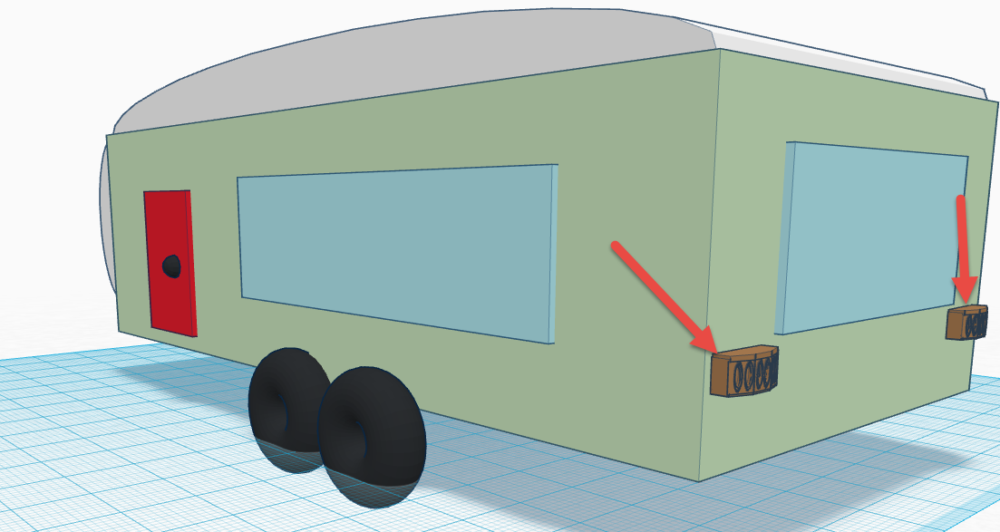
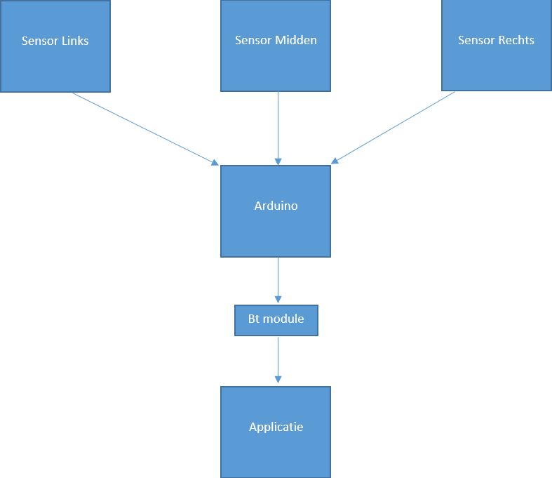
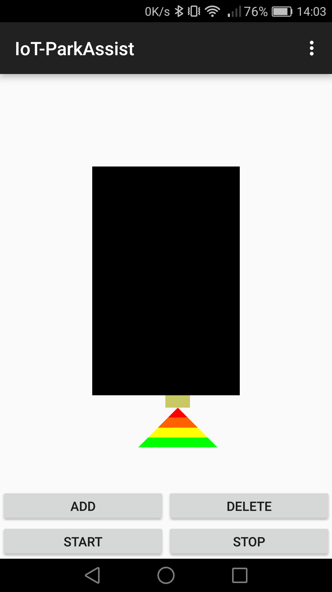
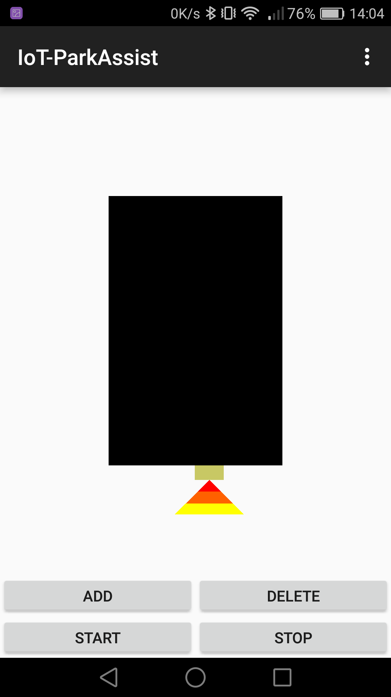

#parkeersensor
In dit document kunt u alles lezen over hoe de parkeersensor werkt.
Ook kan je hier lezen hoe dit allemaal tot stand is gekomen en hoe je dit zelf zou kunnen maken.

<!-- START doctoc generated TOC please keep comment here to allow auto update -->
<!-- DON'T EDIT THIS SECTION, INSTEAD RE-RUN doctoc TO UPDATE -->
 Beschrijving parkeer sensor

- [Beschrijving parkeer sensor](#beschrijving-parkeer-sensor)
  - [Doel van de parkeersensor](#doel-van-de-parkeersensor)
  - [De werking en staat van de parkeer sensor](#de-werking-en-staat-van-de-parkeer-sensor)
  - [Waarom deze oplossing](#waarom-deze-oplossing)
    - [Sensoren](#sensoren)
    - [Communicate](#communicate)
  - [Mogelijke alternatieven](#mogelijke-alternatieven)
    - [Sensoren](#sensoren-1)
    - [Communicatie](#communicatie)
  - [Reflectie](#reflectie)
- [Installatie handleiding parkeer sensor](#installatie-handleiding-parkeer-sensor)
  - [Applicatie installeren](#applicatie-installeren)
- [Gebruikers handleiding parkeer sensor](#gebruikers-handleiding-parkeer-sensor)
  - [Applicatie gebruiken](#applicatie-gebruiken)

<!-- END doctoc generated TOC please keep comment here to allow auto update -->
## Beschrijving parkeer sensor

### Doel van de parkeersensor
De parkeer sensor moet helpen met het kunnen parkeren van een bijvoorbeeld een camper die standaard geen parkeer sensor heeft.
De bedoeling van dit product is dan ook dat deze op het voertuig bevestigd kan worden en dat de bestuurder via een app de informatie binnenkrijgt.
Het zorgt dan voor een makkelijke en portable manier om toch altijd parkeersensoren bij te hebben.
Ter illustratie zou het er ongeveer als volgt eruitzien:
Zo zou de case eruit zien en zoals je ziet zouden er 3 sensoren uit steken.

Een voorbeeld van hoe deze parkeer sensoren bevestigd kunnen worden op de caravan.

### De werking en staat van de parkeer sensor
De parkeer sensor werkt zeer simpel vanaf het moment dat de voedingsbron is aangesloten en de parkeer sensor is aangezet begint hij meteen met detecteren van objecten.
Dit doet hij door 3 internet sensoren die geplaatst zijn op elke 30 graden van elkaar om een totale hoek van 90 graden te bekomen.
De sensoren sturen de data door naar de Arduino die dan zal kijken wat de kleinste afstand is. Deze afstand zal de Arduino doorsturen naar de verbonden applicatie. De applicatie zal dan visueel tonen hoe dicht je op een object zit.
([voor meer info over de applicatie verwijs ik u door naar de applicatie documentatie](documentatie url ))
Schematisch gezien ziet het er als volgt uit:

De huidige van de staat van de parkeer sensor is exact het zelfde als hierboven vermeld.
We kunnen namelijk de afstanden meten en sturen dan ook de kleinste afstand door naar de applicatie.
Vervolgens zal de applicatie visueel tonen hoever het object is van de parkeer sensor.

### Waarom deze oplossing
#### Sensoren
We hebben gekozen voor ultro sonic sensor(HC-SR04) voornamelijk omdat we hier al een keer mee hebben gewerkt alsook hadden we ondervonden dat de IR sensoren niet zo betrouwbaar waren als gehoopt.
Echter na het testen met de standaard sensoren van op school zijn we er achter gekomen dat deze toch een flinke afwijking hebben.
Hoe verder de afstand van een object hoe meer afwijking er op de data zou zitten. Een oplossing hierop zou zijn geweest het filteren van de data en analyseren van de data. Helaas zat op elke sensor een andere afwijking en zou de data ook een stuk onbetrouwbaarder maken en dat is niet echt handig bij parkeer sensoren.
Bij het doornemen van de datasheets van deze sensoren zijn we er ook achter gekomen dat de effectieve meet hoek maar op 15 graden lag. Dit zou betekenen dat we in plaats van 3 nu 6 sensoren nodig hadden en dit zorgde voor veel problemen.
Het werd namelijk onmogelijk om deze zo te plaatsen om een hoek van 90 graden te krijgen (vanwege de formfactor van de sensoren) en het zou onnodige delay veroorzaken wat we niet wilde.
Daarom hebben we uiteindelijk gekozen voor de SEN136B5B ultra sonic senser. Na overleg met onze product owner (meneer Overdulve) zijn deze besteld aangezien dit beter voor ons project zou zijn. Deze sensoren hadden in plaats van 4 maar 3 pinnen als ook de effectieve hoek was 30 inplaats van 15 graden.
Tevens tijdens het testen bleek dat de sensoren ook een stuk betrouwbaarder waren en op grote afstand (200cm) maar ongeveer 2-3 cm afwijking had.

#### Communicate
Voor de communicatie hebben we gekozen voor Bluetooth en maakte we gebruik van de HC-05.
We hebben gekozen voor Bluetooth omdat het een energiezuinige verbinding moest zijn en voer relatief korte afstanden.
De transfer rate van dit protocol was meer dan genoeg voor dit project dus daar waren ook geen problemen.
Keuze voor de HC-05 module was voornamelijk omdat we hier al een hoop ervaring mee hadden en deze in voorraad hadden.

### Mogelijke alternatieven
#### Sensoren
Voor de sensoren hadden we redelijk veel alternatieven:
 - IR sensoren
 - Andere modellen Ultra sonic sensoren
 - Magnetic
 - Laser
 - Capacitive
 - Inductive
 - Photocell
 - Radar
 - ...
De lijst met alternatieven is in dit geval heel groot en hebben ook niet de kans gehad om alles te testen.
Tevens vielen de meeste keuzes eigenlijk al meteen af vanwege de prijs klasse (het product moest ook zo goedkoop mogelijk te maken zijn).
Aangezien onze meeste ervaring lag bij de ultra sonic sensoren hebben we dan ook maar voor deze methode gekozen.

#### Communicatie
Voor communicate waren we voornamelijk maar over 2 dingen aan het denken en dat was Bluetooth of WiFi.
Aangezien voor WiFi de afstand te kort was en we hier totaal nog geen ervaring mee hadden gingen we al snel voor Bluetooth.

### Reflectie

Het eindresultaat ziet er prima uit de sensoren zijn zeer accuraat en de data transfer is snel genoeg waardoor het in de app goed te zien is. Soms zitten er wat verspringingen in doordat de sensoren wat rare data oppakken, maar het is snel genoeg om snel weer de juist data weer te geven. We hadden misschien wel nog een filter kunnen toevoegen op de gemeten waardes en dan pas doorsturen, maar zelfs zonder deze filter werkt het zeer prima.

## Installatie handleiding parkeer sensor
Vanaf dat het PCB in mekaar is gezet ([handleiding PCB](pcb-design.md)) hoef je enkel nog maar de app te installeren en te koppelen.
### Applicatie installeren

Aangezien de applicatie niet helemaal is afgeraakt, is het momenteel enkel mogelijk om met 1 parkeersensor module te werken. Om dit te doen is het noodzakelijk dat je in het bestand [MainActivity.java]() de volgende lijn aanpast met het MAC adres van de bluetooth module die je gebruikt.

> //lijn 113
> addSensor(x, y, 0, "20:16:01:26:15:73");

Voor we de app kunnen gebruiken, zullen we deze eerst op de smartphone moeten zetten. Om dit te doen, verbinden we de smartphone met de laptop en openen we de applicatie in "Android Studio". In Android studio klik je op run in het menu, waarna je je smartphone selecteert en op "OK" klikt.

Na een tijdje zal er op je scherm gevraagd worden of je de applicatie wilt installeren, selecteer hier "installeren". Nu wordt de applicatie geïnstalleerd, waarna deze klaar is om te gebruiken.

## Gebruikers handleiding parkeer sensor
Voor in gebruik name van de parkeer sensor moet je enkel de voedingsbron aansluiten en de parkeersensor aan te zetten.
Dit wordt gedaan doormiddel van de schakelaar om te zetten naar links of rechts (beide kanten doet hetzelfde).

Uiteraard is het ook belangrijk dat je de parkeer sensor stevig vast maakt op het voorwerp waar je het voor wilt gebruiken.

### Applicatie gebruiken
Voor we de applicatie starten is het belangrijk dat het enigste aan je smartphone gekoppelde bluetooth device, de bluetoothmodule van de parkeersensor is.

Indien dit zo is, kan je de applicatie opstarten en beginnen te gebruiken. aangezien dit de eerste keer is dat je het gebruikt, zal er nog geen module toegevoegd zijn aan de applicatie. Het toevoegen van een module doe je door op "Add" te klikken, waarna je op een plaats rond het zwarte vlak (dit stelt de caravan voor) klikt. Indien je dicht genoeg rond het zwarte vlak hebt geklikt, zal er hier een module verschijnen.

Omdat je de parkeersensor al aan je smartphone hebt gekoppeld, zal je ook meteen de afstand te zien krijgen.

Zoals je ziet is de afstand in vier kleuren verdeelt, waarbij iedere kleur een afstand van 50cm voorstelt. Indien de afstand kleiner dan 2m is, zal je dus ook kleuroppervlakken zien verkleinen of totaal zien verdwijnen.

Indien je een sensor wilt verwijderen zal dit op het moment niet gaan, aangezien deze functie niet helemaal is afgeraakt.