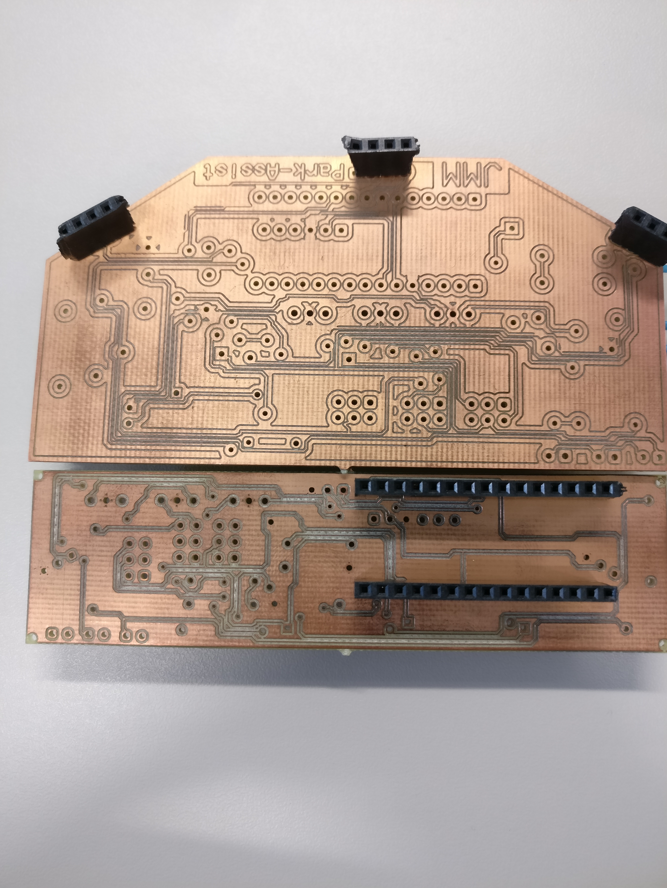

##PCB design
Onze eerste revisie van het PCB design was vooral gericht op een zo klein mogelijke form factor.
Dit hebben we gedaan aangezien dit gegvraagd was door onze product owner (meneer Overdulve).
Hierom hebben we gekozen om componenten aan weerszijden te plaatsen dit zorgt ervoor dat we zo weinig mogelijk ruimte gebruiken.
Onze eerste design was dan ook een rechthoekig blok met het kleinst mogelijke form factor voor dat moment.
Uiteraard hebben we wel rekening moeten houden met de sensoren die plek in namen als ook de hoek waarin deze zouden moeten staan.
Hieronder is ons eerste design te zien (het onderste pcb is de 1e revisie):

Echter zaten hier nog wat kleine foutjes in als ook waren de pads om te solderen veel te klein.
Hierdoor werd het haast onmogelijk om dit goed te solderen zonder dat dit op de power plane kwam.

Hierom zijn we dan ook begonnen aan een 2e revisie van het PCB design. Deze zou ervoor moeten zorgen voor het makkelijker te solderen door grotere pads en meer spacing tussen de powerplane en de pads. Ook werd in deze versie rekening gehouden met het case design. De case heeft namelijk afgezaagde hoeken dit zou dan ook terug moeten komen in het PCB design. Als ook het toevoegen van extra componenten werd in deze revisie gedaan.
De componenten die zijn toegevoegd:
 - Led voor status weergave
 - power switch voor het makkelijker aan en uitzetten van de Arduino

Zoals je op het plaatje ziet is het bovenste design de tweede revisie.
